# Kafka Example

## Description

This sample demonstrates sending a message with the Kafka producer activity and receiving it with a Kafka consumer trigger.

The Producer flow produces a message on the specified topic whenever the REST endpoint is triggered.
The Consumer flow has a consumer trigger that listens to the specified topic and receives the message whenever it is sent. Additionally, the "commit offset" activity notifies the consumer to commit the offset, and the final "Log" activity prints the received message.

## Prerequisites

* An active Kafka cluster (bootstrap servers in the form broker1:9092,broker2:9092).
* If your cluster uses SSL/SASL or a Schema Registry (Avro), ensure you have credentials and the registry URL.
* Local runtime configured in Visual Studio Code (for building/running the Flogo app).

## Create Kafka Application

1. Install TIBCO Flogo Extention for Visual Studio Code and Create new flogo app in it. 

2. In the newly created Flogo app, go to CONNECTIONS > Create Connection > Apache Kafka Client Configuration..

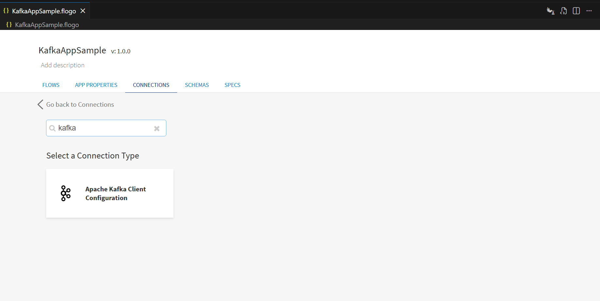

3. Configure the Kafka connection details and click Save to save the connection.

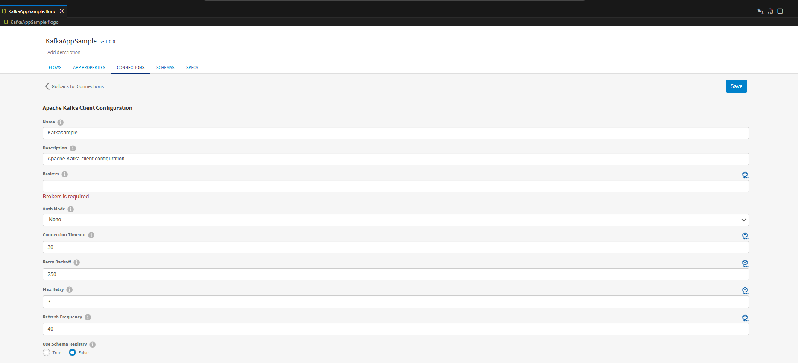

The following details are required to create the Kafka connection:

 a. Host - In this field we give public ip/public DNS of EC2 instance on which database is hosted or the ip of VM where the Kafka Brocker is   hosted in tibco premises.

 b. Port - Enter the port on which the server is running.

 c. Brokers - Enter the broker URL to which you are connecting.

 d. Auth Mode - Select one of the following authentication types to connect with the Kafka cluster:

    * None: To establish the connection without authentication.

    * SASL/PLAIN: To use Simple Authentication Security Layer (SASL) PLAIN authentication.

    * SSL: To use Secure Socket Layer (SSL) authentication.

    * SASL/SCRAM-SHA-256: To connect to the Kafka cluster configured for SASL/SCRAM with hash SHA-256 functions.

    * SASL/SCRAM-SHA-512: To connect to the Kafka cluster configured for SASL/SCRAM with hash SHA-512 functions.

    * SASL/OAUTHBEARER: To use Simple Authentication Security Layer (SASL) with OAuth Bearer functions.

e. Connection Timeout - The amount of time in seconds to wait for the initial connection.

f. Retry Backoff - The amount of time in milliseconds to wait for the leader election to occur before retrying.

g. Max Retry - The number of attempts to retry metadata requests when the cluster is in the middle of a leader election.

h. Refresh Frequency - The amount of time in seconds after which metadata is refreshed.

i. Use Schema Registry - Enables you to use the Avro schema with a Schema Registry by selecting True.

### The Flows and Commit offset activity

1. If you open the app, you will see there are two flows in the KafkaAppSample app. The flow 'producer' and second flow 'consumer'.

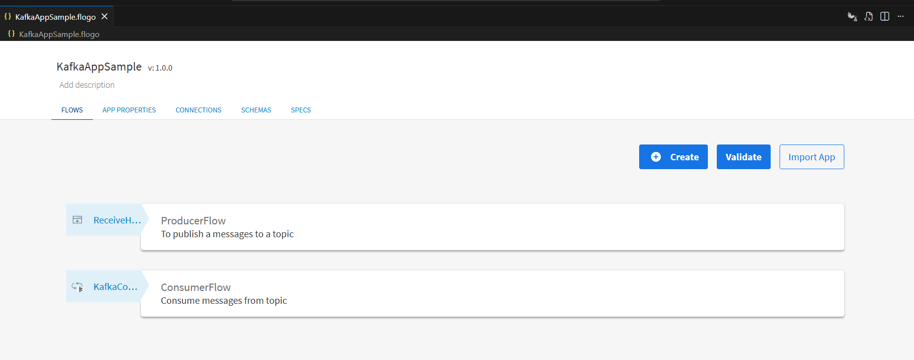

2. The Producer flow produces a message on the mentioned topic, whenever the REST endpoint is triggered. REST trigger has method GET with path parameter 'produce'.

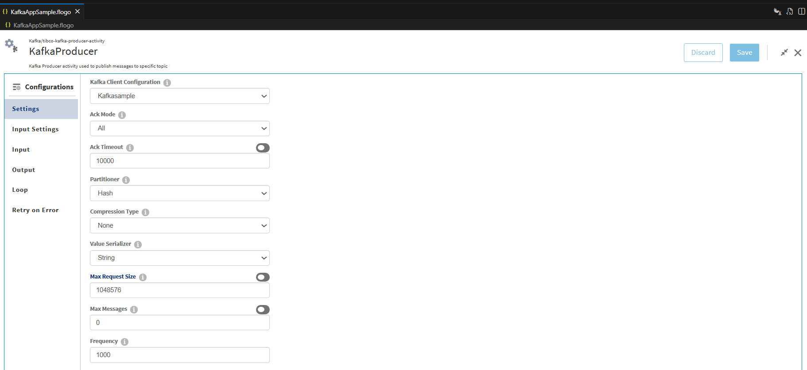

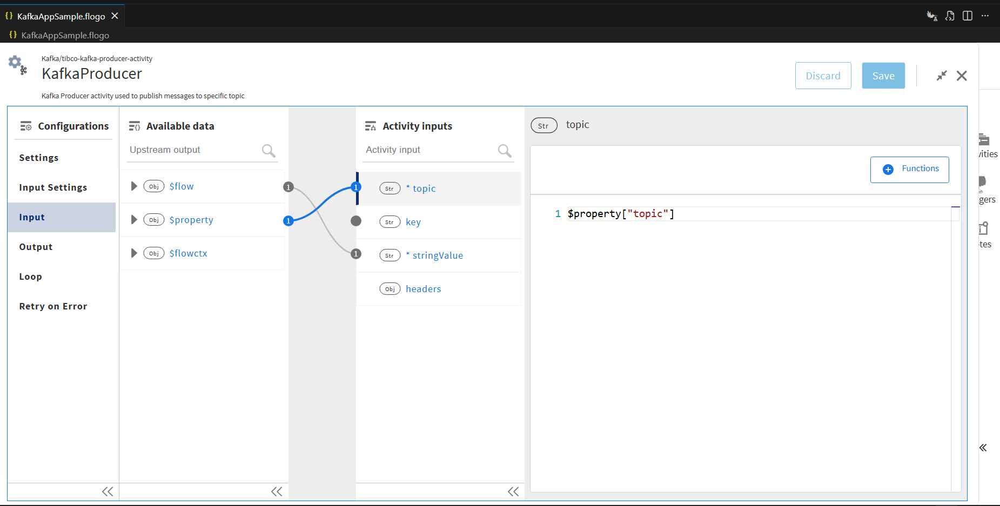

3. The Consumer flow has the consumer trigger which is listening to the mentioned topic and receives the message whenever it is sent. Further, the 'commit offset' activity notifies the consumer to commit the offset and The final 'Log' activity is prints the received message.
Note: If 'commit offset' activity is not used the consumer commits the offset at the end of the flow.

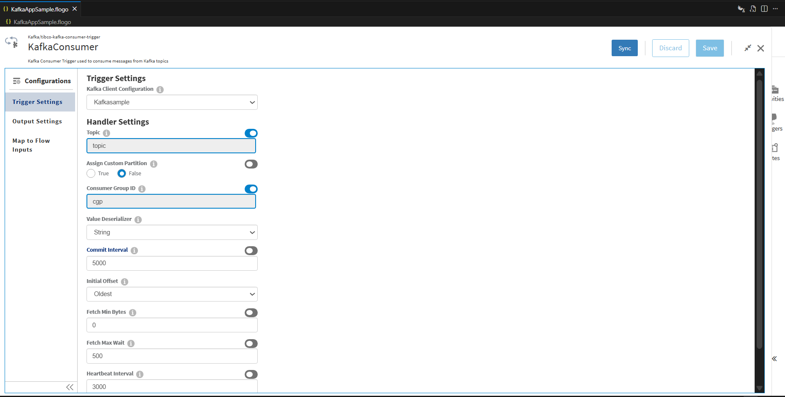

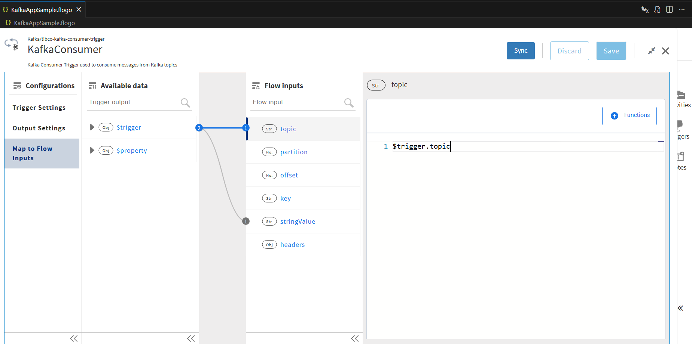

### Run the application

For running the application, 
1. Start by adding a local runtime in Visual Studio Code. Assign a name to the runtime and click the "Save" button.

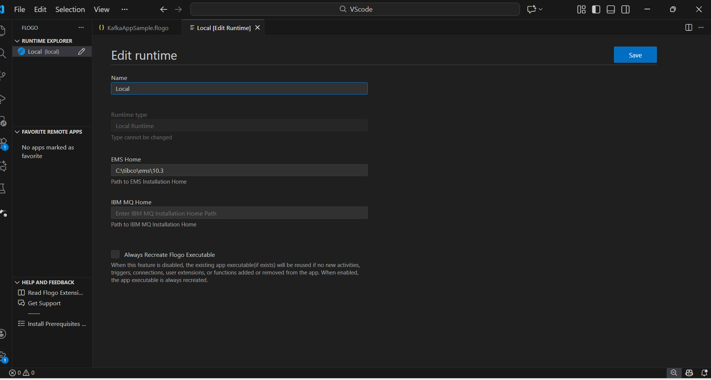

2. Select the local runtime you added for your Flogo Kafka app. To do this, click on the FLOGO APP in the explorer, then click "Actions" and select the added Local Runtime.

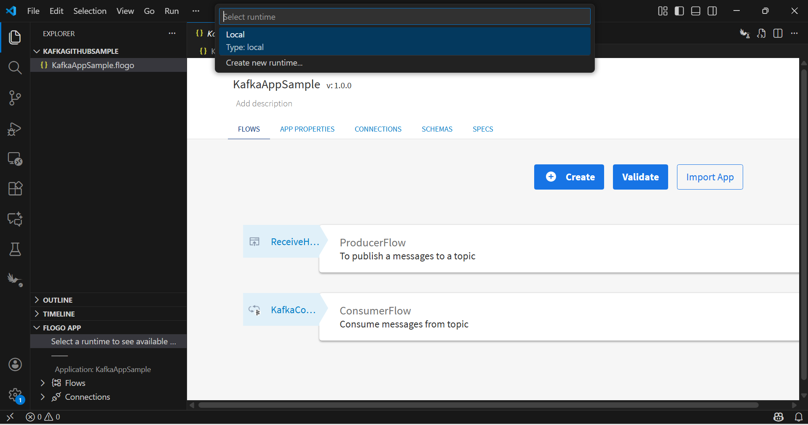

3. Now Build your Flogo Kafka app. In the FLOGO APP section, click on "Build,".

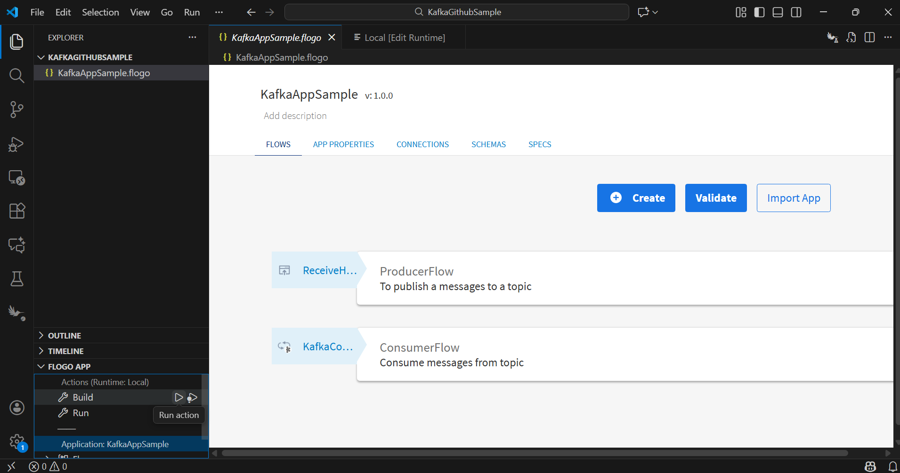

4. Once build is successful you can see the binary in bin folder.

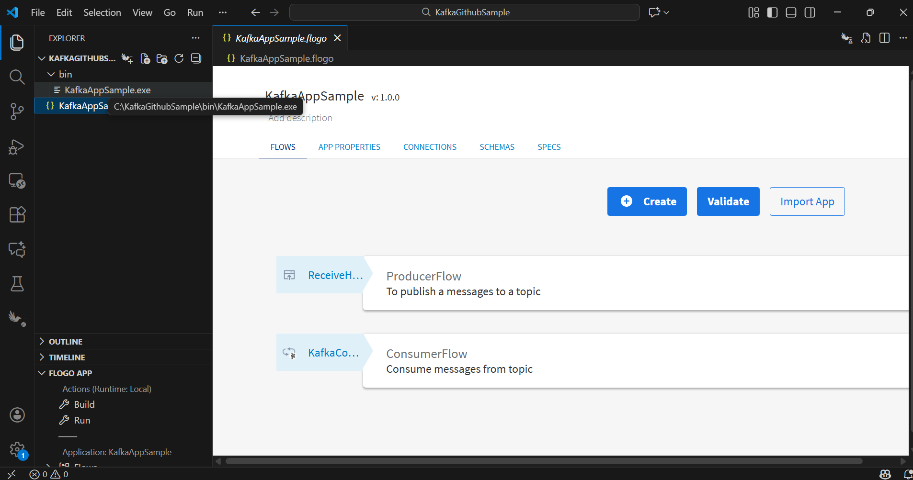

5. Now Run the Kafka app. 

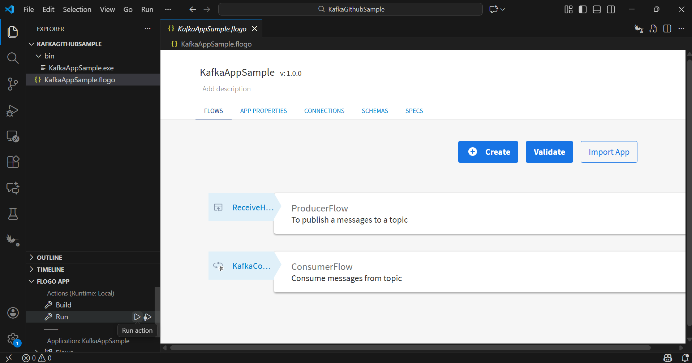

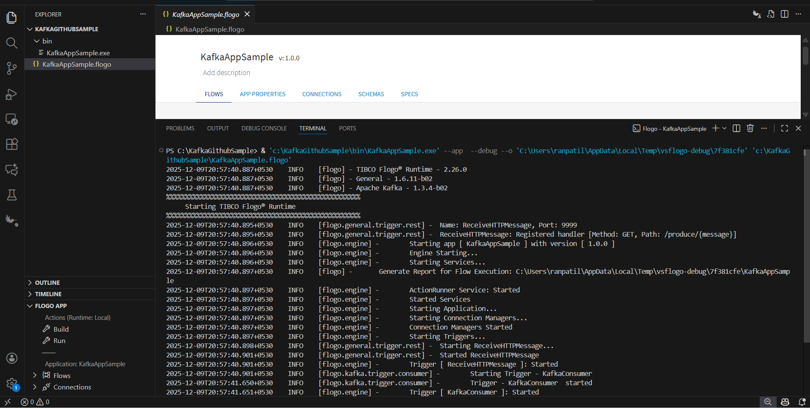

6. After running app hit the endpoint and see the results.

7. After endpoint hit you will able to see the logs in VS code terminal.

## Outputs

1. Verify output by hiting the endpoint

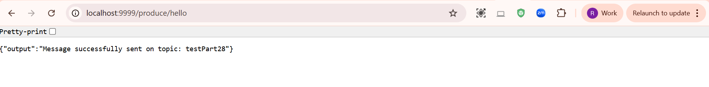

2. Verify output in VS code terminal

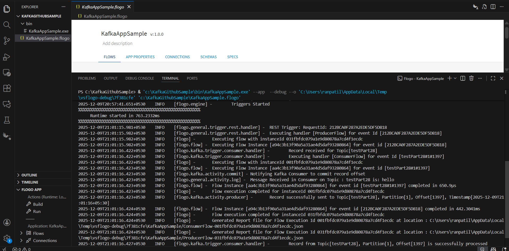

## Troubleshooting

* Connection refused: verify bootstrap.servers and firewall rules.
* Authentication errors: confirm SASL/SSL credentials and auth mode.
* No messages delivered: check topic existence, partitions, and consumer group settings.

## Help

See TIBCO Flogo Extension for VS Code docs: https://docs.tibco.com/products/tibco-flogo-extension-for-visual-studio-code-latest

